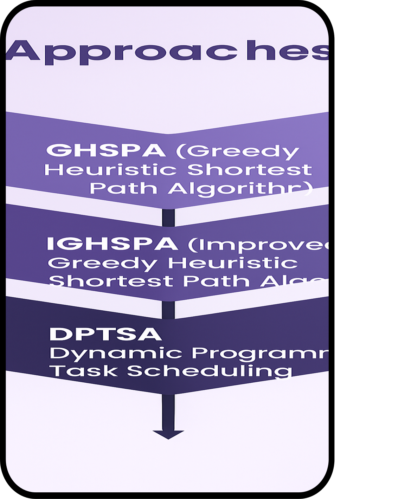
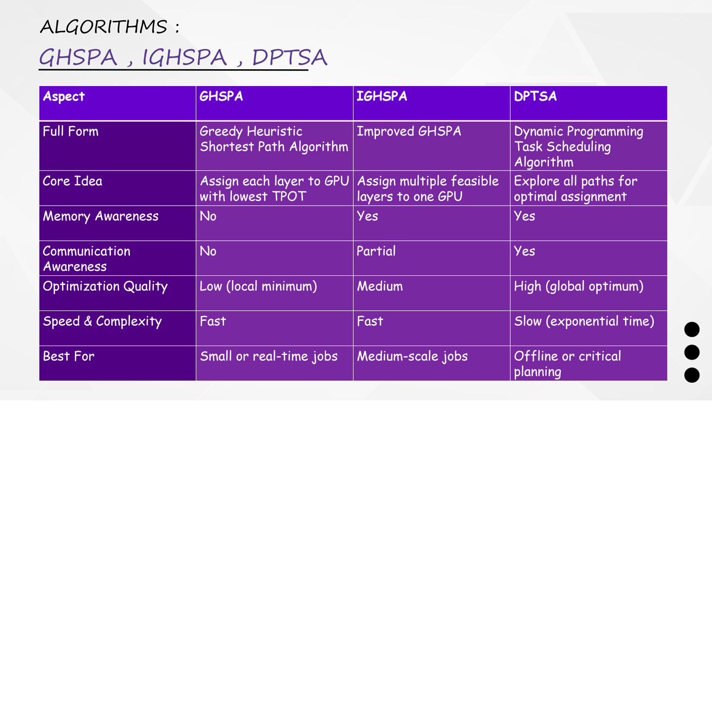
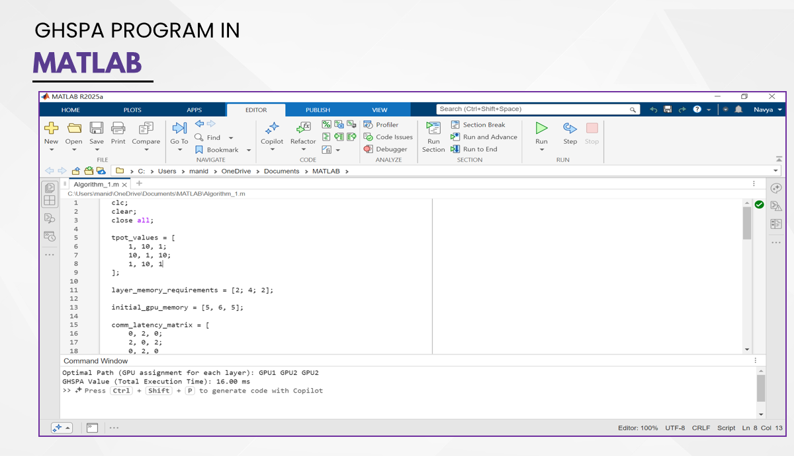
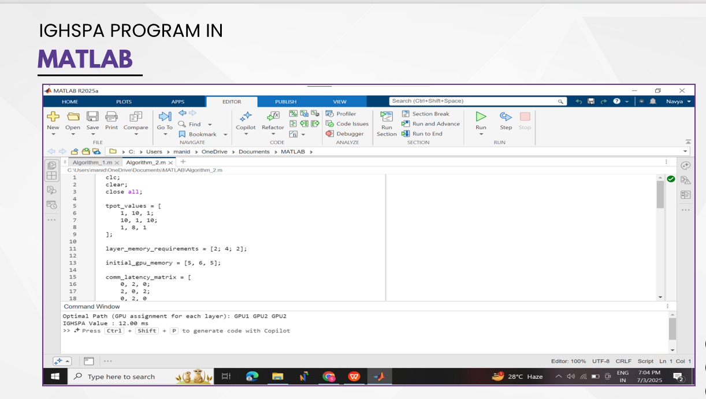
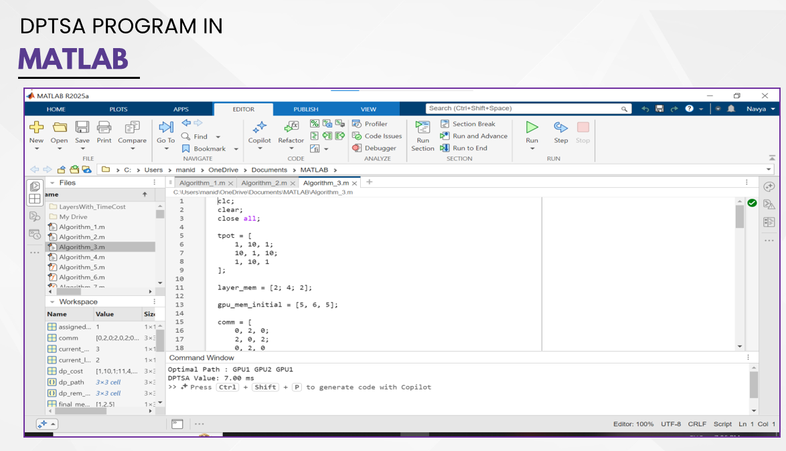
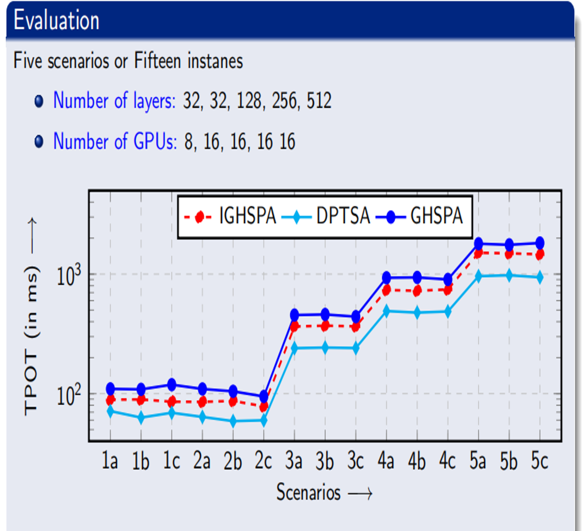
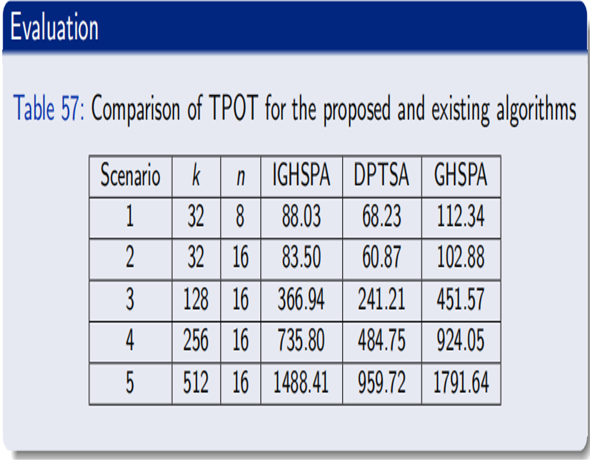

# LLM-Based Task Scheduling System

## Overview
A decentralized LLM-based task scheduling system for heterogeneous 
networks, focused on GPU and resource allocation optimization.

## Algorithms Developed
- Algorithm 1: GHSPA — Greedy Heuristic Shortest Path Algorithm
- Algorithm 2: IGHSPA — Improved Greedy Heuristic Shortest Path Algorithm
- Algorithm 3: DPTSA — Dynamic Programming Task Scheduling Algorithm (Proposed)

## Key Features
- GPU and resource allocation strategies
- TPOT (Time Per Output Token) performance measurement
- Task distribution across heterogeneous computing environments

## Results

### Approaches

### Algorithm Differences

### GHSPA Output

### IGHSPA Output

### DPTSA Output

### TPOT Evaluation Across Scenarios

### TPOT Comparison — Proposed vs Existing Algorithms

## Output Files
- Gpu_Layers.xlsx — GPU layer allocation results
- layerswithTime.xlsx — Layer execution time analysis

## Tools Used
- MATLAB

## Internship
National Institute of Technology Warangal (May 2025 - Jun 2025)
